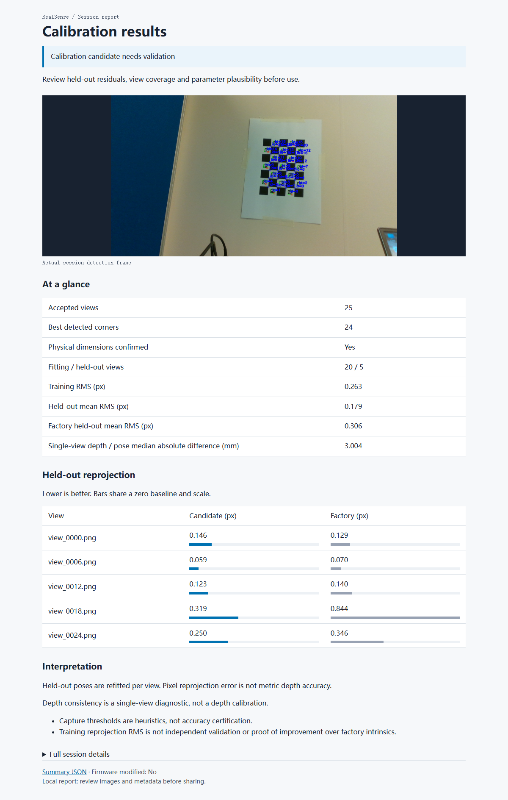

# RealSense Calibration Tools

**From a printed ChArUco board to a reviewable calibration result.**

Marker-guided capture, color-camera calibration and RGB-D diagnostics for RealSense D435i.
Automatic frame selection. Local reports. No firmware changes.

[Quick start](#quick-start) · [Demo data](docs/demo/d435i_charuco_results.json) · [User guide](docs/AUTOMATIC_CALIBRATION.md) · [MIT license](LICENSE)

## Real-device demo



*The same compact report is generated for every session. All 17 markers and 24 inner corners were detected in this demo.*

One session at **1280 × 720**, using a **5 × 7 ChArUco board** with measured
**24 mm squares / 12 mm markers**.

**25 captured views → 20 fitting views + 5 held-out views.** Training RMS: **0.263 px**.
Mean held-out RMS: **0.179 px** for the candidate versus **0.306 px** for factory intrinsics;
lower in **4 of 5** views. [Source data](docs/demo/d435i_charuco_results.json)

[Detection image](docs/demo/charuco_detection.png) · [Comparison chart](docs/demo/reprojection_comparison.png)

*Single-session demonstration, not an accuracy certification. Poses are refitted on held-out views.
Pixel reprojection error is not metric depth accuracy.*

## What it does

- **Prepare:** generate printable ChArUco, checkerboard and ArUco targets.
- **Inspect:** export factory parameters, detect the board and check pose/depth consistency.
- **Capture:** select sharp, stable views and reject near-duplicate poses.
- **Calibrate:** fit color intrinsics, evaluate held-out views and export JSON + HTML reports.

You move the camera or board; the tool handles detection and capture.
It does not recalibrate the depth module or overwrite device calibration.

## Quick start

### 1. Install

```bash
conda env create -f environment.yml
conda activate rs_calib
pip install -e .
```

### 2. Prepare the board

[Download the printable board](assets/patterns/charuco_A4_7x5_25mm.pdf), print at actual size,
and mount it flat. Enter **measured** square/marker dimensions in
[`configs/boards/charuco_A4_7x5_25mm.yaml`](configs/boards/charuco_A4_7x5_25mm.yaml).
The demo's 24 / 12 mm dimensions apply only to its measured print. [Printing guide](docs/PRINTING_SOP.md)

### 3. Inspect and capture

Run from the repository root with the environment activated:

```bash
python scripts/run_calib.py --mode inspect --seconds 10
python scripts/run_calib.py --mode auto --seconds 180 --views 25 --preview --confirm-board-size
```

Move across the image, vary distance and tilt, and hold each pose still for about two seconds.
Use `--confirm-board-size` only after checking the measured dimensions. Press **Q** to stop;
omit `--preview` for headless capture. A stationary setup is not enough for intrinsic calibration.

## Outputs

Each run creates a separate `outputs/sessions/<timestamp>/` directory:

| Files | Contents |
|---|---|
| `factory.json`, `board.yaml` | Device parameters and board configuration |
| `images/`, `capture.json` | Selected views and capture-quality records |
| `color_intrinsics.json` | Calibration candidate and held-out diagnostics |
| `summary.json`, `report.html` | Status, board pose and depth consistency |

The HTML report shows the detection image, key metrics, per-view errors and next action;
full details stay collapsed. The terminal prints a short result summary and report path.
Rebuild it without a camera: `python scripts/run_calib.py --mode report --session outputs/sessions/SESSION`.

Incomplete capture returns exit code `2`; successful fitting remains a **candidate needing validation**.
Raw sessions, serial numbers and calibration packages stay Git-ignored. This demo publishes only
an approved detection image and anonymized metrics.

## Documentation & development

[Automatic workflow](docs/AUTOMATIC_CALIBRATION.md) · [Manual workflow](docs/REALSENSE_SOP.md) · [Output schema](docs/OUTPUT_SCHEMA.md)

```bash
python -m unittest discover -s tests -v
pip install -e ".[demo]"  # Optional chart-rendering dependency
python docs/demo/render_demo.py
```

Tests cover synthetic detection, pose, holdout separation and data integrity; CI does not use a physical camera.
The demo chart is regenerated directly from the published JSON.
